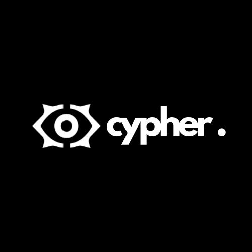

  

<h1 align="center">Cypher</h1>

    <em><code> "Your password, your protection." </code></em>

    <a href="https://github.com/ChixMagnet08">Timtim, Abraham Jerico C.</a> 
    IT-2106

---

  
<strong>Table of Contents<strong>

  
  - [Project Overview](#project-overview)
  - [Problem Statement: Chosen SDG](#problem-statement-chosen-sdg)
  - [OOP Principles](#oop-principles)
  - [Features](#features)

---

##  Project Overview

The majority of individuals struggle to generate and keep safe passwords, and they frequently choose weak or easily guessable combinations. However, strong passwords are crucial for protecting personal information and online accounts. Cypher is a Java console application designed to help users create stronger, more secure passwords by enforcing essential security standards. By offering an easy and effective way to meet these requirements, Cypher encourages users to adopt better security practices. Aligned with cybersecurity best practices, Cypher empowers users to make informed decisions when setting passwords, significantly reducing the risk of unauthorized access.

---

## Problem Statement: Chosen SDG

SDG 16 focuses on promoting peace, justice, and strong institutions by fostering transparent, accountable systems. "Cypher" directly contributes to these goals by enhancing digital security through password strength evaluation.

    
   
  <em>SDG 3: Supporting the health and well-being of Human.</em>

---

## OOP Principles
The project incorporates Object-Oriented Programming (OOP) principles to ensure modularity, reusability, and clear structure.

1. **Encapsulation**  
   - Store user details (e.g., age, weight, dietary restrictions) and meal data as private fields with public methods for access and modification.  

2. **Inheritance**  
   - A Meal parent class with subclasses like Breakfast, Lunch, and Dinner.  

3. **Polymorphism**  
   - Override a suggestMeal method to provide unique meal options for each subclass..  

4. **Abstraction**  
   -Use an interface MealPlanner with methods like generatePlan(), viewMeals(), and trackNutrients().

---

## Features
Meal Planning:
o   "The application generates a daily meal plan, including breakfast, lunch, dinner, and snacks, tailored to the user’s health goals and dietary preferences."
Nutritional Tracking:
o   "Users can view a summary of their total daily calorie intake and macronutrient distribution, helping them stay on track."
Personalization:
o   "Users input their age, weight, height, health goal (e.g., weight loss, muscle gain), and dietary preferences to receive customized meal suggestions."

---
